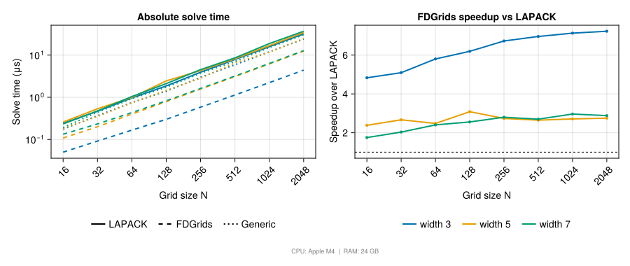
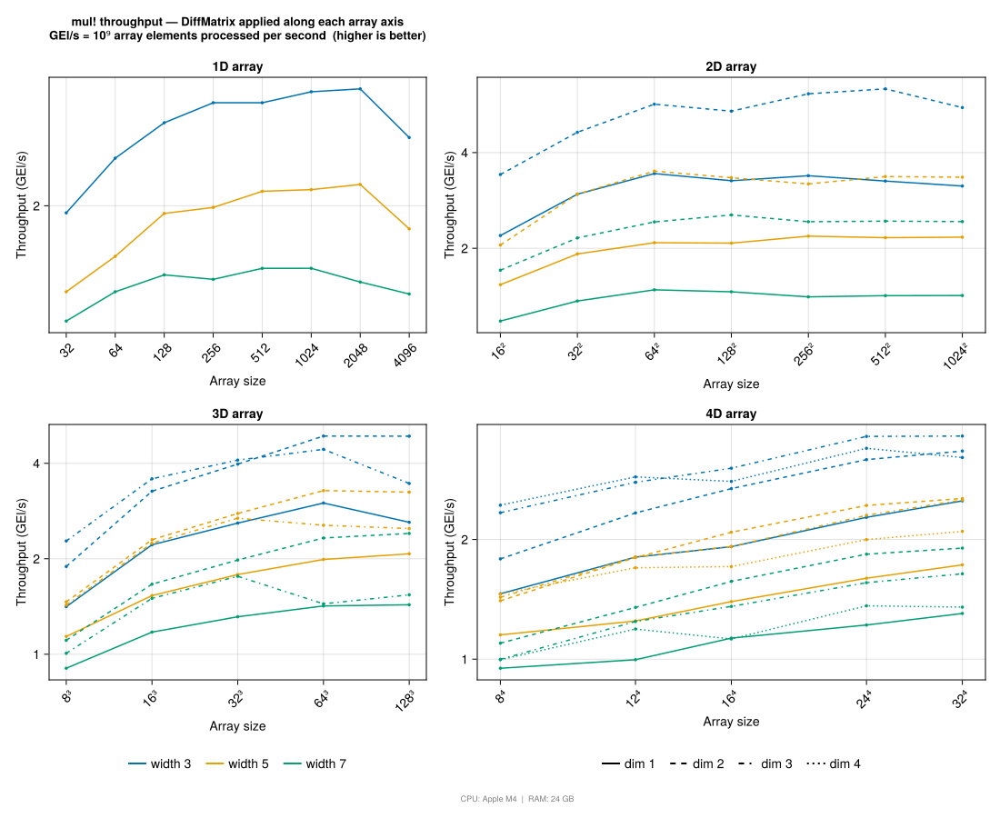

# Benchmarks

The scripts in `benchmarks/` measure the two performance-critical operations
in FDGrids: linear solves and matrix–vector products.  Each script saves an
SVG figure to `docs/src/assets/benchmarks/`.

To reproduce the figures:

```bash
# One-time setup (from the package root)
julia --project=benchmarks -e '
    using Pkg
    Pkg.develop(path=".")
    Pkg.instantiate()'

julia --project=benchmarks benchmarks/linsolve.jl
julia --project=benchmarks benchmarks/matmul.jl
```

## Linear solve

Compares three solve paths on a 1D grid, sweeping over grid sizes N = 32 … 2048
and stencil widths 3, 5, 7:

| Path | How |
|------|-----|
| **LAPACK** | `lu(D)` → LAPACK `dgbtrf!`/`dgbtrs!` (pivoted banded LU) |
| **FDGrids** | `lu!(copy(D))` → `@generated` `ldiv!` (unrolled, no pivoting) |
| **Generic** | same in-place factorisation → plain scalar loop reference |

The left panel shows absolute solve time; the right panel shows the speedup of
the FDGrids compact path over LAPACK.

```@raw html

```

## Matrix–vector product

Benchmarks `mul!(y, D, x, Val(dim))` for:

- Array dimension N = 1, 2, 3, 4 (square arrays, same size along every axis)
- Differentiation direction `dim` = 1 … N
- Stencil widths 3, 5, 7
- A range of per-axis sizes (total element count on the x-axis)

Throughput is reported in **GElements/s** (total elements divided by wall time).
Line colour encodes stencil width; line style encodes the differentiation
direction.

```@raw html

```
